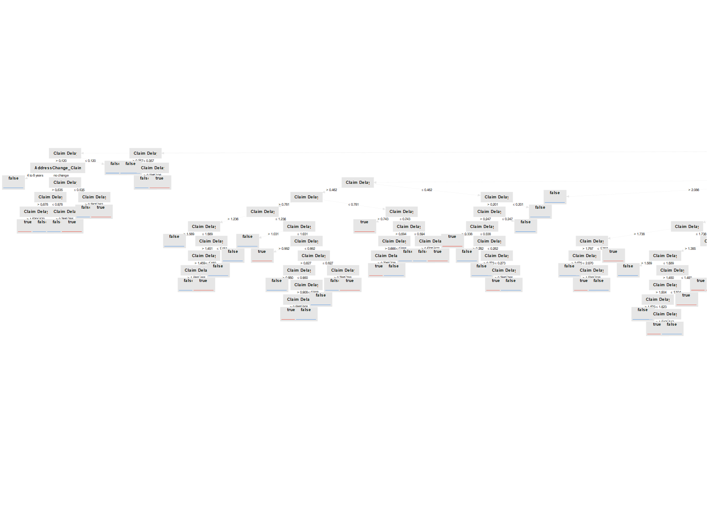

# Insurance Fraud Analysis

## Description

A data-driven analysis of Australian motor insurance claims using Power BI and RapidMiner to identify fraud patterns and build predictive models for fraud detection.

## Overview

Insurance fraud is a significant challenge in Australia's general insurance sector, particularly in car insurance. According to the Insurance Council of Australia, fraudulent claims cost insurers hundreds of millions of dollars annually. This not only leads to increased premiums for honest policyholders but also strains the industry's resources.

This project explores a historical dataset of motor insurance claims in Australia. The dataset includes both fraudulent and non-fraudulent records, and covers a range of features such as:

- Vehicle characteristics  
- Driver demographics  
- Accident details  
- Policy information  

By analyzing this data, the project aims to uncover patterns that may indicate fraudulent behavior, contributing to better fraud detection and improved policy management.

## Objectives

The project consists of two main tasks:

### 1. Exploratory Data Analysis (EDA)

Using **Power BI**, the goal is to:

- Explore and visualize patterns across genuine and fraudulent claims  
- Identify key indicators and trends associated with fraud  
- Generate actionable insights to inform fraud detection and prevention strategies  
- Apply good data visualization principles for clarity and impact  

#### Power BI Dashboard Previews:

**Page 1 – Overview of Claims**

**Page 2 – Fraud Pattern Insights**

### 2. Predictive Modeling

Using **RapidMiner**, the goal is to:

- Build and evaluate predictive models to classify claims as fraudulent or genuine  
- Compare the performance of at least two supervised learning algorithms  
- Manually configure models and avoid the use of automated tools or features  
- Interpret and explain model outputs to inform business decision-making  

#### Decision Tree Model

**RapidMiner Process**

**Inside Cross-Validation Process**

**Decision Tree Output**

**Confusion Matrix**

#### Random Forest Model

**RapidMiner Process**

**Inside Cross-Validation Process**

**Example Tree in Random Forest**

**Confusion Matrix**

## Tools & Technologies

- **Power BI**: For interactive dashboards and data visualization  
- **RapidMiner**: For machine learning model building and evaluation  
- **CSV Data**: Historical motor insurance claims data from the Australian context  

## Key Findings

### EDA Insights

- **Vehicle Age & Brand**: Older vehicles (11+ years) with recent address changes show high fraud rates (59%). Luxury brands like Ferrari and Mercedes have fraud rates exceeding 70%.  
- **State & Vehicle Style**: Some states show high fraud rates based on vehicle style, such as sports cars in the ACT (78%).  
- **Claim Delay**: Negative claim delays (claims filed before accident dates) strongly indicate fraud.  
- **Driver Demographics**: Young drivers with P licenses under specific policies (e.g., All Perils and Liability) had 100% fraud rates.  
- **Risk Factors**: Risky driving behaviours, wet weather conditions, and certain occupations (e.g., flight attendants, medical assistants) are linked with higher fraud rates.  
- **Occupational Patterns**: Security guards and physical therapists are associated with higher-cost fraudulent repairs.  
- **Holiday Fraud**: Married drivers often submit claims before accident dates during holiday weeks, suggesting premeditated fraud.  
- **Over-Insurance**: Younger drivers with low ratings driving high-value vehicles may indicate deliberate over-insurance.  
- **Educational Background**: Fraud is more frequent in drivers with occupations requiring higher education, such as dentists and therapists.  

### Predictive Modeling Results

- **Key Predictor**: `Claim Delay` was the most decisive factor in both Decision Tree and Random Forest models.  
- **Decision Tree**: Simpler and interpretable, with 52.61% accuracy, but lower recall (28.77%) and F1-score (35.11%).  
- **Random Forest**: More effective overall with higher recall (44.43%) and F1-score (45.58%) despite slightly lower accuracy (51.21%). Better at identifying actual fraud cases.  
- **Recommendation**: The Random Forest is more reliable for detecting fraud despite being less interpretable.  

## Business & Ethical Implications

- **Real-Time Monitoring**: Use claim delay and other risk indicators to flag suspicious cases early.  
- **Enhanced Data Sources**: Incorporate unstructured data (e.g., claim narratives, behavioural patterns) and external data (e.g., vehicle repair records) for better predictions.  
- **Clustering Techniques**: Use unsupervised learning to discover hidden fraud patterns.  
- **Privacy & Fairness**: Models must avoid biases, respect user privacy, and follow ethical AI standards.  
- **Transparency**: Ensemble methods like Random Forest are less explainable—insurers must balance accuracy with accountability.  
- **Human Oversight**: Predictive models should support, not replace, human judgment in fraud investigations.  

## Relevance

With the growing importance of artificial intelligence and machine learning in Australia's financial and insurance sectors, this project provides practical insights into how data-driven methods can support fairer and more efficient insurance practices.

## Contributors
- [yxiao66666](https://www.linkedin.com/in/yxiao66666/) 
